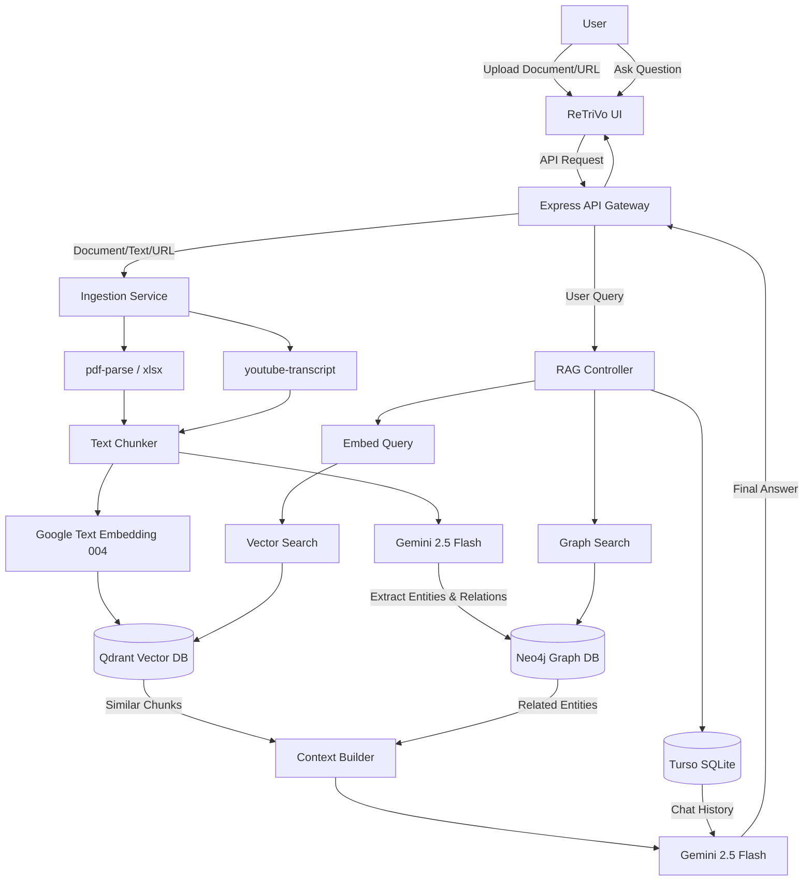

# 📚 ReTriVo
---

## ✨ Features

- 📄 **Multi-Document Upload** – Upload PDF, CSV, and XLSX documents to build your personal knowledge base
- 🎥 **YouTube Integration** – Extract and index knowledge directly from YouTube video URLs
- 📝 **Text Content Support** – Add custom text content as additional context
- 🤖 **AI-Powered Chat** – Ask questions about your uploaded content using Google Gemini 2.5 Flash
- 🧠 **Conversational Memory** – Remembers chat history for contextual AI responses
- 📊 **GraphRAG Support** – Neo4j integration for complex entity relationships
- 🔍 **Semantic Search** – Uses vector embeddings for intelligent content retrieval
- 🔐 **Authentication** – Secure user authentication via Clerk
- 🎨 **Modern UI** – Beautiful, responsive interface with dark mode and glassmorphism effects
- ⚡ **Real-time Responses** – Fast conversational AI responses

---

## 🛠 Tech Stack

### Frontend
| Technology | Purpose |
|------------|---------|
| **React 19** | UI Framework |
| **Vite 7** | Build Tool & Dev Server |
| **Tailwind CSS 4** | Utility-first CSS styling |
| **Axios** | HTTP Client |
| **Clerk** | Authentication |
| **Lucide React** | Icons |

### Backend
| Technology | Purpose |
|------------|---------|
| **Express 5** | Web Framework |
| **LangChain** | LLM Application Framework |
| **Google Gemini 2.5 Flash** | Language Model |
| **Google Text Embedding 004** | Vector Embeddings |
| **Neo4j** | Graph Database for Knowledge Graph |
| **Turso (libSQL)** | SQL Database for App Data & Chat History |
| **Qdrant** | Vector Database for Embeddings |
| **Multer** | File Upload Handling |
| **pdf-parse / xlsx** | File Parsing & Extraction |
| **youtube-transcript** | YouTube Video Transcript Extraction |

---

## 🚀 Getting Started

### Prerequisites

- **Node.js** v18+ 
- **npm** or **yarn**
- **Qdrant Cloud Account** (or self-hosted Qdrant instance)
- **Google AI API Key**
- **Clerk Account** (for authentication)

### Installation

#### 1. Clone the Repository

```bash
git clone https://github.com/KunalNib/Rag-Chatbot.git ReTriVo
cd ReTriVo
```

#### 2. Setup Backend

```bash
cd backend
npm install
```

Create a `.env` file in the `backend` directory:

```env
GOOGLE_API_KEY=your_google_ai_api_key
QDRANT_URL=your_qdrant_cloud_url
QDRANT_API_KEY=your_qdrant_api_key
```

Start the backend server:

```bash
npm start
```

The backend will run on `http://localhost:3000`

#### 3. Setup Frontend

```bash
cd frontend
npm install
```

Create a `.env` file in the `frontend` directory:

```env
VITE_CLERK_PUBLISHABLE_KEY=your_clerk_publishable_key
```

Start the frontend development server:

```bash
npm run dev
```

The frontend will run on `http://localhost:5173`

---

## 📖 API Reference

### Upload Content

```http
POST /api/upload
```

Upload a PDF file and/or text content to the knowledge base.

| Parameter | Type | Description |
|-----------|------|-------------|
| `pdf` | `file` | PDF file to upload (optional) |
| `text` | `string` | Text content to add (optional) |

**Response:**
```json
{
  "success": true,
  "message": "pdf loaded successfully"
}
```

---

### Chat with AI

```http
POST /api/chat
```

Ask a question about the uploaded content.

| Parameter | Type | Description |
|-----------|------|-------------|
| `question` | `string` | The question to ask |

**Response:**
```json
{
  "answer": "AI-generated response based on your content"
}
```

---

## 🏗 System Architecture

The application implements a full GraphRAG architecture combining vector search with graph-based entity relationships for superior retrieval context.



---

## 📁 Project Structure

```text
ReTriVo/
├── backend/
│   ├── index.js         # Main Express API and RAG logic
│   ├── db.js            # Turso database connection & schema
│   ├── services/        # Neo4j and GraphRAG services
│   ├── controllers/     # API controllers for upload, document, chat
│   ├── routes/          # Express route definitions
│   └── .env             # Backend environment variables
│
├── frontend/
│   ├── src/
│   │   ├── main.jsx        # Root entry with Clerk Provider
│   │   ├── App.jsx         # Routing (Public Home vs Protected Notebook)
│   │   ├── HomePage.jsx    # Marketing landing page
│   │   └── RAGNotebook.jsx # Core application workspace
│   ├── public/             # Static assets
│   └── .env                # Frontend environment variables
│
└── README.md
```

## 🎨 Screenshots

The application features a modern dark-themed interface with:

- **Split-panel layout** – Left panel for content upload, right panel for chat
- **Gradient accents** – Indigo to purple gradients for branding
- **Glassmorphism effects** – Subtle backdrop blur and transparency
- **Real-time chat** – User and AI messages styled distinctively

---

## 🔐 Environment Variables

### Backend (`.env`)

| Variable | Description |
|----------|-------------|
| `GOOGLE_API_KEY` | Your Google AI API key for Gemini & Embeddings |
| `QDRANT_URL` | Qdrant Cloud cluster URL |
| `QDRANT_API_KEY` | Qdrant API key for authentication |
| `TURSO_DATABASE_URL` | Turso database URL for storing chat history and metadata |
| `TURSO_AUTH_TOKEN` | Turso auth token for database access |
| `NEO4J_URI` | Neo4j AuraDB URI |
| `NEO4J_USERNAME` | Neo4j AuraDB Username |
| `NEO4J_PASSWORD` | Neo4j AuraDB Password |

### Frontend (`.env`)

| Variable | Description |
|----------|-------------|
| `VITE_CLERK_PUBLISHABLE_KEY` | Clerk publishable key for auth |

---

## 🔒 8. Security & User Isolation

- **Clerk Authentication**: Ensures only registered users can access the notebook.
- **Header-Based Identity**: The Frontend sends the `x-user-id` in every request.
- **Semantic Filtering**: Qdrant queries are strictly constrained to the `userId` metadata, preventing cross-user data leaks.
- **Cloud Integrity**: PDFs are stored in Cloudinary with unique IDs, and metadata is stored in Turso with strict relational mapping.

---

## 📜 Scripts

### Backend

| Command | Description |
|---------|-------------|
| `npm start` | Start server with nodemon (hot-reload) |

### Frontend

| Command | Description |
|---------|-------------|
| `npm run dev` | Start Vite dev server |
| `npm run build` | Build for production |
| `npm run preview` | Preview production build |
| `npm run lint` | Run ESLint |

---

## 🤝 Contributing

Contributions are welcome! Please feel free to submit a Pull Request.

1. Fork the repository
2. Create your feature branch (`git checkout -b feature/AmazingFeature`)
3. Commit your changes (`git commit -m 'Add some AmazingFeature'`)
4. Push to the branch (`git push origin feature/AmazingFeature`)
5. Open a Pull Request

---

## 📄 License

This project is licensed under the ISC License.

